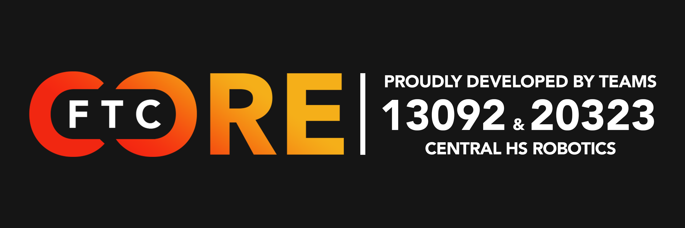

# Home

<figure><figcaption>
FTC-Core was originally developed by Daniel Huinda, Zack Murry, and Garrison Taylor of Central Robotics
</figcaption></figure>

FTC-Core is maintained by Central High School Robotics in Springfield, MO.

## What's FTC Core?

FTC Core is a multi-purpose Java library designed to allow FTC teams to create advanced autonomous and tele-op systems in under 100 lines of code. FTC Core bridges the transition from block coding to Java programming by simplifying navigation, localization, and other complex functions into a simple builder pattern that is understandable and extremely easy to tune. FTC Core is also modular, allowing teams to extend their own functionality on top of the library to ensure teams can integrate their own advanced functions.

###

<figure><figcaption>
Using FTC-Core, team #13092 performs a 4-cone autonomous for Power Play during the 2022-23 FTC season
</figcaption></figure>

## Who is this for?

FTC-Core is intentionally designed to be useful for any team. We use a builder framework to make the creation of complex autonomous programs intuitive for beginners, and convenient for veteran users. That way, programmers can spend less time worried about getting the robot where it needs to be, and spend more time confronting each new challenge presented by that season's game. In other words, FTC-Core is for everyone!
